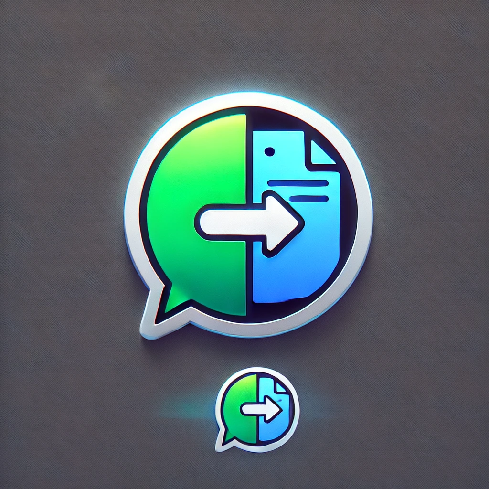

# Claude.ai Chat Exporter

  

A Chrome extension that allows you to export your Claude.ai conversations to Markdown or JSON format.

## Features

- Export Claude.ai conversations to Markdown format
- Export Claude.ai conversations to JSON format
- Debug tool to help identify page structure issues
- Preserves conversation structure, including:
  - Chat title and timestamp
  - Message roles (Human/Claude)
  - Message content with formatting
  - Code blocks with language syntax

## Installation

### From Chrome Web Store (Coming Soon)
1. Visit the Chrome Web Store (link to be added)
2. Click "Add to Chrome"
3. Confirm the installation

### Manual Installation
1. Download or clone this repository
2. Open Chrome and navigate to `chrome://extensions/`
3. Enable "Developer mode" (toggle in the top-right corner)
4. Click "Load unpacked"
5. Select the folder containing the extension files

## Usage

1. Navigate to any conversation on Claude.ai (https://claude.ai/chat/*)
2. Click on the extension icon in your toolbar
3. Select "Export as Markdown" or "Export as JSON"
4. Choose a location to save the exported file

### Debugging
If you encounter issues with the extension not extracting messages:
1. Click the "Debug Page Structure" button
2. Save the JSON file when prompted
3. The file contains information that can help diagnose extraction issues

## File Structure

- `manifest.json` - Extension configuration
- `popup.html` - Extension popup interface
- `popup.js` - Popup functionality
- `content.js` - Extract data from Claude.ai page
- `turndown.js` - HTML to Markdown conversion library
- `background.js` - Ensures content script is properly loaded
- `icons/` - Extension icons
- `TROUBLESHOOTING.md` - Solutions for common issues

## Troubleshooting

If you experience issues with the extension, please see the `TROUBLESHOOTING.md` file for common solutions.

## Dependencies

- [Turndown](https://github.com/mixmark-io/turndown) - HTML to Markdown converter

## Development

### Requirements
- Chrome browser
- Basic knowledge of JavaScript

### Building the Extension
No build process is required. The extension is ready to use after downloading.

## License

MIT License